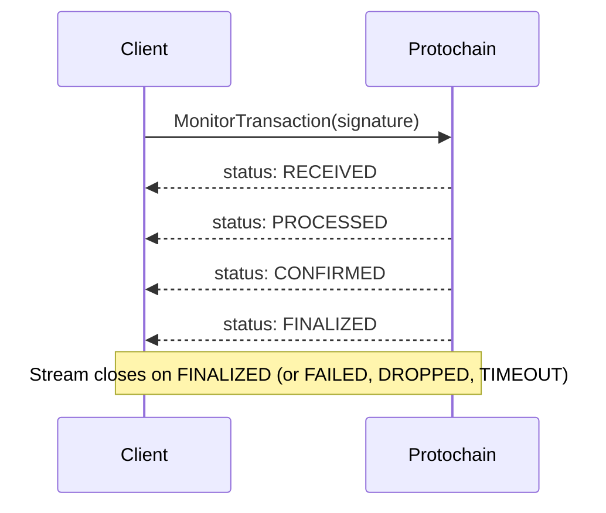

<objective>
Write the MonitorTransaction page as a guide-style reference — different template from unary method pages (per D-04). This is the only streaming RPC in the entire Protochain API and requires a narrative stream lifecycle walkthrough, not just a field list.

Purpose: Developers understand how to consume a gRPC server stream, what status updates to expect, and how to handle terminal states (FINALIZED, FAILED, DROPPED, TIMEOUT).

Output: 1 MDX file replacing the stub.
</objective>

<execution_context>
@~/.claude/get-shit-done/workflows/execute-plan.md
@~/.claude/get-shit-done/templates/summary.md
</execution_context>

<context>
@.planning/PROJECT.md
@.planning/ROADMAP.md
@.planning/phases/03-account-and-transaction-service-reference/03-CONTEXT.md
@.planning/phases/03-account-and-transaction-service-reference/03-RESEARCH.md

<interfaces>
<!-- MonitorTransaction request fields: -->
<!--   signature (string, required) — from SubmitTransaction response -->
<!--   commitment_level (CommitmentLevel, optional) — stream closes when this level reached (or FINALIZED) -->
<!--   include_logs (bool, optional) — if true, include program execution logs in responses -->
<!--   timeout_seconds (uint32, optional) — monitoring timeout, defaults to 60 seconds -->

<!-- MonitorTransactionResponse fields (each message in the stream): -->
<!--   signature (string) — the signature being monitored -->
<!--   status (TransactionStatus enum) — current status -->
<!--   slot (uint64) — slot where this status was recorded -->
<!--   error_message (string) — error details if status is FAILED -->
<!--   logs (string[]) — program logs (only if include_logs was true) -->
<!--   compute_units_consumed (uint64) — available on PROCESSED and later -->
<!--   current_commitment (CommitmentLevel) — commitment level achieved at time of this update -->

<!-- TransactionStatus enum (7 values): -->
<!--   TRANSACTION_STATUS_UNSPECIFIED = 0 — not set -->
<!--   TRANSACTION_STATUS_RECEIVED = 1 — received by validator, stream continues -->
<!--   TRANSACTION_STATUS_PROCESSED = 2 — processed (commitment: processed), stream continues -->
<!--   TRANSACTION_STATUS_CONFIRMED = 3 — confirmed (commitment: confirmed), stream continues or closes -->
<!--   TRANSACTION_STATUS_FINALIZED = 4 — finalized, STREAM CLOSES -->
<!--   TRANSACTION_STATUS_FAILED = 5 — transaction failed during execution, STREAM CLOSES -->
<!--   TRANSACTION_STATUS_DROPPED = 6 — transaction dropped from network, STREAM CLOSES -->
<!--   TRANSACTION_STATUS_TIMEOUT = 7 — monitoring timeout reached, STREAM CLOSES -->

<!-- Stream lifecycle: -->
<!-- 1. Client calls MonitorTransaction with signature -->
<!-- 2. Server streams updates: RECEIVED → PROCESSED → CONFIRMED → FINALIZED -->
<!-- 3. Stream closes on: FINALIZED, FAILED, DROPPED, TIMEOUT -->
<!-- 4. If commitment_level = CONFIRMED, stream closes on CONFIRMED (not FINALIZED) -->

<!-- Page structure (guide-style, not standard unary template per D-04): -->
<!-- 1. Frontmatter -->
<!-- 2. Opening + Note about streaming RPC -->
<!-- 3. ## Stream Lifecycle (narrative + Mermaid sequence diagram) -->
<!-- 4. ## Request (ResponseField) -->
<!-- 5. ## Stream Responses (ResponseField per MonitorTransactionResponse field) -->
<!-- 6. ## TransactionStatus Values (table with stream behavior) -->
<!-- 7. ## Code Examples (full stream consumption loop) -->
<!-- 8. Brief reconnection Note linking to guides/monitor-transaction.mdx (per D-05) -->

<!-- Tab order: Go, Rust, TypeScript (D-10) -->
<!-- Code examples show FULL stream loop — this is the exception to "minimal" per D-11 -->
<!-- because streaming consumption requires more setup than a unary call -->
</interfaces>
</context>

<tasks>

<task type="auto">
  <name>Task 1: MonitorTransaction guide-style page</name>
  <files>api-reference/transaction/monitor-transaction.mdx</files>
  <read_first>
    - api-reference/transaction/monitor-transaction.mdx (current stub)
    - .planning/phases/03-account-and-transaction-service-reference/03-RESEARCH.md (full MonitorTransaction section: request fields, response fields, TransactionStatus enum, stream lifecycle, gotchas — sections "MonitorTransaction (STREAMING)" and "MonitorTransaction Page Pattern")
    - .planning/phases/03-account-and-transaction-service-reference/03-CONTEXT.md (D-04: guide-style page, D-05: brief reconnection note linking to Phase 5 guide)
    - .planning/research/STACK.md (Mermaid sequence diagram syntax — "sequenceDiagram" section)
  </read_first>
  <action>
Write the MonitorTransaction page as a guide-style reference. This is NOT the standard unary template — it uses narrative sections and a Mermaid diagram.

**Full page structure:**

---

Frontmatter:
```yaml
title: "MonitorTransaction"
description: "Stream real-time status updates for a submitted transaction."
```

Opening paragraph:
"Monitors an on-chain transaction's progress by streaming status updates until the transaction reaches a terminal state. Call MonitorTransaction immediately after [SubmitTransaction](/api-reference/transaction/submit-transaction) using the returned signature."

Note callout:
```
<Note>
  MonitorTransaction is a **server-streaming RPC** — the server sends multiple response messages over a single connection until the transaction reaches a terminal state. Consuming it requires a different pattern than unary calls. See the code examples below for the full stream loop.
</Note>
```

---

## Stream Lifecycle

"When you call MonitorTransaction, the server begins watching for the transaction and emits a new response message each time the transaction advances to a new status. The stream remains open until a terminal status is reached."

Mermaid sequence diagram (use ```mermaid code fence):


"The stream closes when any of the following terminal statuses are received: **FINALIZED**, **FAILED**, **DROPPED**, or **TIMEOUT**. If `commitment_level` is set to CONFIRMED, the stream closes on CONFIRMED without waiting for FINALIZED."

---

## Request

ResponseField for `signature`: type "Base58-encoded string", required. "The transaction signature to monitor. Returned by [SubmitTransaction](/api-reference/transaction/submit-transaction)."

ResponseField for `commitment_level`: type "CommitmentLevel (enum)". "Optional. The target commitment level — the stream closes when this level is reached (or on FINALIZED if FINALIZED was requested). Defaults to CONFIRMED."
Include `<CommitmentLevelNote />`.

ResponseField for `include_logs`: type "bool". "Optional. If true, program execution logs are included in status update responses. Defaults to false."

ResponseField for `timeout_seconds`: type "uint32". "Optional. How many seconds to monitor before emitting a TIMEOUT status and closing the stream. Defaults to 60 seconds."

---

## Stream Responses

"Each message in the stream is a `MonitorTransactionResponse`:"

ResponseField for `signature`: type "Base58-encoded string". "The signature being monitored."
ResponseField for `status`: type "TransactionStatus (enum)". "The current on-chain status of the transaction. See TransactionStatus Values below."
ResponseField for `slot`: type "uint64". "The blockchain slot where this status was recorded."
ResponseField for `error_message`: type "string". "Human-readable error details. Populated when `status` is FAILED."
ResponseField for `logs`: type "string[]". "Program execution log lines. Only populated if `include_logs` was true in the request."
ResponseField for `compute_units_consumed`: type "uint64". "Compute units consumed by the transaction. Available on PROCESSED and later statuses."
ResponseField for `current_commitment`: type "CommitmentLevel (enum)". "The commitment level that has been achieved at the time of this update."

---

## TransactionStatus Values

Table of all 7 enum values:

| Status | Value | Meaning | Stream Behavior |
|--------|-------|---------|-----------------|
| `TRANSACTION_STATUS_UNSPECIFIED` | 0 | Not set | — |
| `TRANSACTION_STATUS_RECEIVED` | 1 | Transaction received by a validator | Stream continues |
| `TRANSACTION_STATUS_PROCESSED` | 2 | Transaction processed (Processed commitment) | Stream continues |
| `TRANSACTION_STATUS_CONFIRMED` | 3 | Transaction confirmed (Confirmed commitment) | Stream continues or closes (if commitment_level = CONFIRMED) |
| `TRANSACTION_STATUS_FINALIZED` | 4 | Transaction finalized (Finalized commitment) | **Stream closes** |
| `TRANSACTION_STATUS_FAILED` | 5 | Transaction failed during on-chain execution | **Stream closes** |
| `TRANSACTION_STATUS_DROPPED` | 6 | Transaction dropped from the network | **Stream closes** |
| `TRANSACTION_STATUS_TIMEOUT` | 7 | Monitoring window expired | **Stream closes** |

Note callout after the table:
```
<Note>
  **TIMEOUT** means the monitoring window expired, not that the transaction failed. The transaction may still be processing on-chain. If you receive TIMEOUT, call [GetTransaction](/api-reference/transaction/get-transaction) to check current status, or start a new MonitorTransaction with the same signature.

  **DROPPED** means the transaction was not processed. If the transaction's blockhash has not yet expired, you may resubmit. If expired, call [CompileTransaction](/api-reference/transaction/compile-transaction) to recompile with a fresh blockhash.
</Note>
```

---

## Code Examples

"The following examples show the full stream consumption loop — the minimal API call plus status handling for each terminal state."

CodeGroup with Go/Rust/TypeScript. Tab order: Go, Rust, TypeScript (D-10).

Go:
```go Go
stream, err := client.MonitorTransaction(ctx, &transaction_v1.MonitorTransactionRequest{
    Signature: "YourTransactionSignature1111111111111111111",
})
if err != nil {
    log.Fatal(err)
}

for {
    resp, err := stream.Recv()
    if err == io.EOF {
        break // Stream closed by server
    }
    if err != nil {
        log.Printf("Stream error: %v", err)
        break
    }

    fmt.Printf("Status: %v (slot %d)\n", resp.Status, resp.Slot)

    switch resp.Status {
    case transaction_v1.TransactionStatus_TRANSACTION_STATUS_FINALIZED:
        fmt.Println("Transaction finalized")
        return
    case transaction_v1.TransactionStatus_TRANSACTION_STATUS_FAILED:
        fmt.Printf("Transaction failed: %s\n", resp.ErrorMessage)
        return
    case transaction_v1.TransactionStatus_TRANSACTION_STATUS_DROPPED:
        fmt.Println("Transaction dropped — consider resubmitting")
        return
    case transaction_v1.TransactionStatus_TRANSACTION_STATUS_TIMEOUT:
        fmt.Println("Monitoring timed out — check GetTransaction for current status")
        return
    }
}
```

Rust:
```rust Rust
let mut stream = client.monitor_transaction(tonic::Request::new(MonitorTransactionRequest {
    signature: "YourTransactionSignature1111111111111111111".to_string(),
    ..Default::default()
})).await?.into_inner();

while let Some(resp) = stream.message().await? {
    println!("Status: {:?} (slot {})", resp.status(), resp.slot);

    match resp.status() {
        TransactionStatus::Finalized => {
            println!("Transaction finalized");
            break;
        }
        TransactionStatus::Failed => {
            println!("Transaction failed: {}", resp.error_message);
            break;
        }
        TransactionStatus::Dropped => {
            println!("Transaction dropped — consider resubmitting");
            break;
        }
        TransactionStatus::Timeout => {
            println!("Monitoring timed out — check GetTransaction for current status");
            break;
        }
        _ => {} // RECEIVED, PROCESSED, CONFIRMED — stream continues
    }
}
```

TypeScript:
```typescript TypeScript
const req = new MonitorTransactionRequest();
req.setSignature("YourTransactionSignature1111111111111111111");

const stream = client.monitorTransaction(req);

stream.on("data", (response) => {
  const status = response.getStatus();
  console.log(`Status: ${status} (slot ${response.getSlot()})`);

  switch (status) {
    case TransactionStatus.TRANSACTION_STATUS_FINALIZED:
      console.log("Transaction finalized");
      break;
    case TransactionStatus.TRANSACTION_STATUS_FAILED:
      console.log("Transaction failed:", response.getErrorMessage());
      break;
    case TransactionStatus.TRANSACTION_STATUS_DROPPED:
      console.log("Transaction dropped — consider resubmitting");
      break;
    case TransactionStatus.TRANSACTION_STATUS_TIMEOUT:
      console.log("Monitoring timed out — check GetTransaction");
      break;
  }
});

stream.on("end", () => console.log("Stream closed"));
stream.on("error", (err) => console.error("Stream error:", err));
```

---

After the code examples, add a Note for production patterns (per D-05):
```
<Note>
  The examples above show the basic stream consumption loop. For production use — including reconnection logic, exponential backoff, and multi-signature monitoring — see the [Monitor Transactions guide](/guides/monitor-transaction).
</Note>
```
  </action>
  <verify>
    grep -c "sequenceDiagram\|TRANSACTION_STATUS_FINALIZED\|TRANSACTION_STATUS_TIMEOUT\|TRANSACTION_STATUS_DROPPED\|TRANSACTION_STATUS_FAILED\|TRANSACTION_STATUS_RECEIVED\|TRANSACTION_STATUS_PROCESSED\|TRANSACTION_STATUS_CONFIRMED" /Users/kylesmith/Development/docs/api-reference/transaction/monitor-transaction.mdx
    # Should be >= 8 (one per unique string)
  </verify>
  <acceptance_criteria>
    - File contains "sequenceDiagram" (Mermaid diagram present)
    - File contains "TRANSACTION_STATUS_FINALIZED" (terminal status in table)
    - File contains "TRANSACTION_STATUS_TIMEOUT" (TIMEOUT status documented with recovery action)
    - File contains "TRANSACTION_STATUS_DROPPED" (DROPPED status documented)
    - File contains "TRANSACTION_STATUS_FAILED" (FAILED status documented)
    - File contains "Stream closes" or "stream closes" (terminal state behavior documented)
    - File contains "server-streaming" or "server streaming" (streaming nature explained in Note)
    - File contains "io.EOF" or "stream.message()" or "stream.on" (real stream consumption code in examples)
    - File contains "/guides/monitor-transaction" (reconnection guide linked per D-05)
    - File contains "```go Go" and "```rust Rust" and "```typescript TypeScript"
    - File does NOT contain "Coming soon"
  </acceptance_criteria>
  <done>MonitorTransaction page is complete with stream lifecycle diagram, full TransactionStatus documentation, stream consumption code examples in all three languages, and a reconnection note linking to the Phase 5 guide.</done>
</task>

</tasks>

<verification>
```bash
# Stub replaced
grep -L "Coming soon\|under construction" /Users/kylesmith/Development/docs/api-reference/transaction/monitor-transaction.mdx

# All 7 TransactionStatus values present
for status in RECEIVED PROCESSED CONFIRMED FINALIZED FAILED DROPPED TIMEOUT; do
  grep -c "TRANSACTION_STATUS_$status" /Users/kylesmith/Development/docs/api-reference/transaction/monitor-transaction.mdx
done

# Mermaid diagram present
grep "sequenceDiagram" /Users/kylesmith/Development/docs/api-reference/transaction/monitor-transaction.mdx

# Production guide linked
grep "monitor-transaction" /Users/kylesmith/Development/docs/api-reference/transaction/monitor-transaction.mdx | grep "guides"
```
</verification>

<success_criteria>
- MonitorTransaction page (TXN-09) uses guide-style structure (not standard unary template) per D-04
- Page includes a Mermaid sequence diagram showing the status progression
- All 7 TransactionStatus enum values documented in a table with stream behavior column
- TIMEOUT and DROPPED statuses include recovery action guidance
- Code examples show the full stream consumption loop (not just the API call)
- Brief reconnection Note links to /guides/monitor-transaction for production patterns (per D-05)
- Tab order: Go, Rust, TypeScript (per D-10)
- No ResponseExample component (per D-03)
- ResponseField for all fields (per D-14)
</success_criteria>

<output>
After completion, create `.planning/phases/03-account-and-transaction-service-reference/03-04-SUMMARY.md`
</output>
