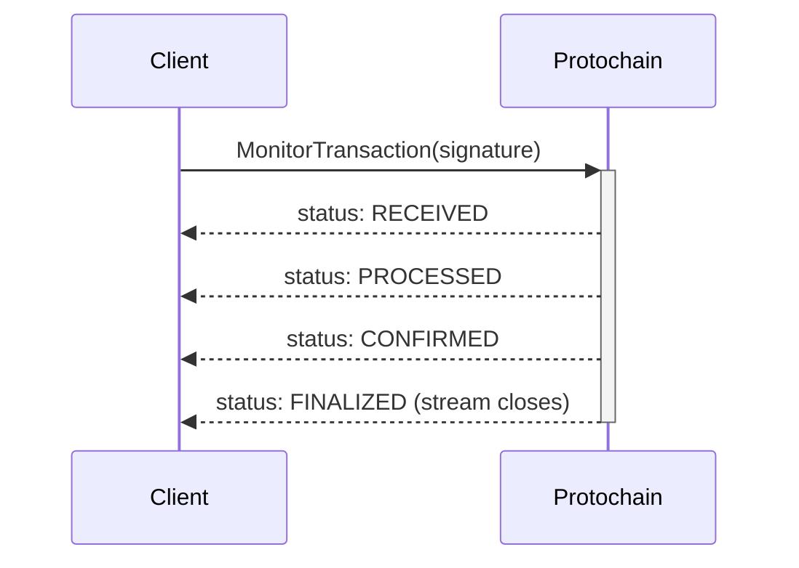

# Phase 3: Account and Transaction Service Reference - Research

**Researched:** 2026-03-25
**Domain:** Mintlify MDX API reference authoring — Account Service (5 methods) and Transaction Service (8 unary + 1 streaming)
**Confidence:** HIGH

---

<user_constraints>
## User Constraints (from CONTEXT.md)

### Locked Decisions

- **D-01:** Each method page has: request fields (ResponseField components), response fields (ResponseField components), and code examples (CodeGroup with Go/Rust/TypeScript tabs). Clean and scannable.
- **D-02:** Field types use developer-friendly descriptions: "Base58-encoded public key (string)" — describe what the value IS, with proto type in parentheses.
- **D-03:** Response documentation uses ResponseField components only — no example JSON responses in sidebar (no ResponseExample). Developers see fields and types, not raw JSON.
- **D-04:** MonitorTransaction gets a dedicated guide-style page — narrative walkthrough of the streaming lifecycle with code examples showing the full stream consumption loop. Not the same template as unary methods.
- **D-05:** Brief reconnection note on the MonitorTransaction page, linking to the Phase 5 "Monitor Transactions" guide for full production patterns (reconnection, error handling, backoff).
- **D-06:** Dedicated error reference page at api-reference/errors.mdx with every TransactionErrorCode value. Method pages link to it rather than documenting errors inline.
- **D-07:** Error page uses table format with columns: Error Code | Description | Retryable | Remediation. Scannable and developer-friendly.
- **D-08:** TransactionSubmissionCertainty levels also documented on the error page with handling guidance per scenario.
- **D-09 (P1 D-04):** Developer-focused tone — concise, no fluff.
- **D-10 (P1 D-11):** Tab order: Go, Rust, TypeScript.
- **D-11 (P1 D-12):** Minimal focused code examples — just the API call + response handling. No imports, connection setup, or error handling.
- **D-12 (P1 D-07):** Each service starts with overview page, then individual method pages.
- **D-13 (P1 D-13):** Link to Getting Started for connection setup — no inline boilerplate.
- **D-14 (P1 D-09):** ResponseField (not ParamField) for all parameter/response docs.

### Claude's Discretion

- Exact wording of method descriptions and behavioral notes
- Which methods deserve extra "gotcha" callouts (e.g., FundNative devnet-only, SubmitTransaction async semantics)
- How to present the TransactionStatus enum values on MonitorTransaction page
- Whether service overview pages list methods as cards, table, or simple list

### Deferred Ideas (OUT OF SCOPE)

None — discussion stayed within phase scope
</user_constraints>

---

<phase_requirements>
## Phase Requirements

| ID | Description | Research Support |
|----|-------------|------------------|
| ACCT-01 | Account Service overview page with service description and method listing | Account service.proto (5 methods confirmed), overview stub exists at api-reference/account/overview.mdx |
| ACCT-02 | GetAccount method documented with request/response fields, code examples in Go/Rust/TypeScript | Full request/response fields extracted from service.proto + account.proto; code pattern established in quickstart |
| ACCT-03 | GenerateNewKeyPair method documented with request/response fields, code examples | Request has optional seed field; response returns KeyPair (already documented in shared-types.mdx) |
| ACCT-04 | FundNative method documented with request/response fields, devnet-only note, code examples | Devnet-only semantics known; airdrop signature in response; commitment_level field present |
| ACCT-05 | GetTokenAccountBalance method documented with request/response fields, code examples | Returns amount (string) + decimals (uint32); note that amount is raw string not decimal-adjusted |
| ACCT-06 | GetAssociatedTokenAddress method documented with request/response fields, token program distinction, code examples | Uses TokenProgram field; token-program-field.mdx snippet reusable |
| TXN-01 | Transaction Service overview page with service description, state machine reference, and method listing | transaction.proto has full state machine; transaction-lifecycle.mdx concept page exists for cross-linking |
| TXN-02 | CompileTransaction method documented with state transition (DRAFT → COMPILED), request/response fields, code examples | State transition enforced by API; recent_blockhash optional (auto-fetched); Transaction message is the core type |
| TXN-03 | EstimateTransaction method documented with fee estimation details, request/response fields, code examples | Returns compute_units + fee_lamports + priority_fee; requires COMPILED state |
| TXN-04 | SimulateTransaction method documented with dry-run semantics, request/response fields, code examples | Returns success bool + error string + logs array; requires COMPILED state |
| TXN-05 | SignTransaction method documented with state transitions, multi-signer support, request/response fields, code examples | oneof signing_method (private_keys or seeds); state transitions COMPILED→PARTIALLY_SIGNED→FULLY_SIGNED |
| TXN-06 | CheckIfTransactionIsExpired method documented with blockhash freshness semantics, code examples | Returns is_expired bool; ~150 slots (~2 minutes) window explained in transaction-lifecycle.mdx |
| TXN-07 | SubmitTransaction method documented with async submission semantics, SubmissionResult enum, error handling, code examples | Returns signature + SubmissionResult enum + error_message + structured TransactionError; async semantics are a critical gotcha |
| TXN-08 | GetTransaction method documented with request/response fields, code examples | Takes signature + commitment_level; returns Transaction message |
| TXN-09 | MonitorTransaction streaming method documented with stream lifecycle, TransactionStatus enum, reconnection patterns, code examples | Only streaming RPC; returns stream of MonitorTransactionResponse; 7 TransactionStatus values; guide-style page per D-04 |
</phase_requirements>

---

## Summary

Phase 3 writes 16 MDX files: 2 service overviews (Account + Transaction), 13 individual method pages, and 1 error reference page. All stub files already exist at the correct paths (`api-reference/account/*.mdx`, `api-reference/transaction/*.mdx`, `api-reference/errors.mdx`) and are wired into `docs.json` navigation — no nav changes required. The work is purely content authoring into existing stubs.

The proto files provide complete, authoritative type information for all request and response messages. The established pattern from Phase 2 (CodeGroup with Go/Rust/TypeScript tabs, ResponseField for all fields, snippets for commitment-level and base58 notes) is the template for all unary method pages. MonitorTransaction is the single exception — it is the only streaming RPC in the entire API and requires a guide-style page with a stream lifecycle walkthrough.

The most important documentation decisions are: (1) SubmitTransaction is async — successful response does NOT mean confirmation; (2) TransactionErrorCode and TransactionSubmissionCertainty form a dual classification system on the error page that allows developers to reason precisely about retry safety; (3) MonitorTransaction stream closes on FINALIZED, FAILED, DROPPED, or TIMEOUT — not just success states.

**Primary recommendation:** Use a two-pass approach — write all unary method pages first using the standard template, then write the MonitorTransaction guide-style page and error reference page which require more editorial judgment.

---

## Complete Proto Type Inventory

This section documents every message type, enum, and field needed to write all pages. This is the authoritative reference for the implementation wave.

### Account Service — Complete Field Reference

#### GetAccount

**Request: `GetAccountRequest`**
| Field | Proto Type | Developer-Friendly Description |
|-------|-----------|-------------------------------|
| `address` | `string` | Base58-encoded account address to fetch (required) |
| `commitment_level` | `CommitmentLevel` | Optional. Ledger state to query. Defaults to CONFIRMED. |

**Response: `GetAccountResponse`**
| Field | Proto Type | Developer-Friendly Description |
|-------|-----------|-------------------------------|
| `account` | `Account` | The account object (see Account fields below) |

**Nested: `Account` message**
| Field | Proto Type | Developer-Friendly Description |
|-------|-----------|-------------------------------|
| `address` | `string` | Base58-encoded account address |
| `lamports` | `uint64` | SOL balance in lamports (1 SOL = 1,000,000,000 lamports) |
| `owner` | `string` | Base58-encoded address of the program that owns this account |
| `executable` | `bool` | True if this account contains a deployed program |
| `data` | `string` | Account data as a JSON string |
| `rent_epoch` | `uint64` | Epoch at which this account will next owe rent |

**Gotchas:** None. Straightforward read. The System Program address (`11111111111111111111111111111111`) is always present on all networks — good for connectivity tests.

---

#### GenerateNewKeyPair

**Request: `GenerateNewKeyPairRequest`**
| Field | Proto Type | Developer-Friendly Description |
|-------|-----------|-------------------------------|
| `seed` | `string` | Optional. Hex-encoded seed for deterministic keypair generation. If omitted, generates a random keypair. |

**Response: `GenerateNewKeyPairResponse`**
| Field | Proto Type | Developer-Friendly Description |
|-------|-----------|-------------------------------|
| `key_pair` | `KeyPair` | The generated keypair (see shared-types.mdx for KeyPair fields) |

**KeyPair fields (already in shared-types.mdx — link, don't repeat):**
- `public_key` — Base58-encoded Ed25519 public key (the Solana account address)
- `private_key` — Hex-encoded Ed25519 private key (32 bytes = 64 hex chars)

**Gotchas:** Private key is returned in plaintext — security warning required. Link to shared-types.mdx for KeyPair definition rather than repeating it.

---

#### FundNative

**Request: `FundNativeRequest`**
| Field | Proto Type | Developer-Friendly Description |
|-------|-----------|-------------------------------|
| `address` | `string` | Base58-encoded address to fund (required) |
| `amount` | `string` | Amount in lamports, as a decimal string (e.g., "1000000000" for 1 SOL) |
| `commitment_level` | `CommitmentLevel` | Optional. Commitment level for airdrop confirmation. |

**Response: `FundNativeResponse`**
| Field | Proto Type | Developer-Friendly Description |
|-------|-----------|-------------------------------|
| `signature` | `string` | Transaction signature of the airdrop |

**Gotchas (CRITICAL — warrants a Warning callout):**
- Devnet only. Calls the Solana devnet faucet. Will fail on mainnet or testnet.
- Amount is a string (not uint64) — proto design choice for precision. Pass as decimal string ("1000000000").

---

#### GetTokenAccountBalance

**Request: `GetTokenAccountBalanceRequest`**
| Field | Proto Type | Developer-Friendly Description |
|-------|-----------|-------------------------------|
| `address` | `string` | Base58-encoded token account address (not the wallet address — the token holding account) |
| `commitment_level` | `CommitmentLevel` | Optional. Ledger state to query. |

**Response: `GetTokenAccountBalanceResponse`**
| Field | Proto Type | Developer-Friendly Description |
|-------|-----------|-------------------------------|
| `amount` | `string` | Raw token balance as a decimal string (not adjusted for decimals) |
| `decimals` | `uint32` | Number of decimal places for the token's mint |

**Gotchas (worth a Note callout):**
- `address` must be the token holding account address, not the wallet/owner address. Use `GetAssociatedTokenAddress` to find the token account address from a wallet address and mint.
- `amount` is the raw integer balance. To get the human-readable value: `amount / (10 ^ decimals)`. For example, amount "1000000" with decimals 6 equals 1.0 token.

---

#### GetAssociatedTokenAddress

**Request: `GetAssociatedTokenAddressRequest`**
| Field | Proto Type | Developer-Friendly Description |
|-------|-----------|-------------------------------|
| `owner_address` | `string` | Base58-encoded wallet address that owns (or will own) the token account |
| `mint_address` | `string` | Base58-encoded address of the token mint |
| `token_program` | `TokenProgram` | Which token program the mint uses: TOKEN_PROGRAM_LEGACY or TOKEN_PROGRAM_2022 |

**Response: `GetAssociatedTokenAddressResponse`**
| Field | Proto Type | Developer-Friendly Description |
|-------|-----------|-------------------------------|
| `address` | `string` | Base58-encoded address of the associated token account (PDA) |

**Gotchas:**
- Returns the derived PDA address regardless of whether the account exists on-chain. Use `GetAccount` on the returned address to check existence.
- Must use the correct token_program — SPL Token and Token-2022 ATAs are at different PDA addresses for the same wallet + mint pair.
- Use the `token-program-field.mdx` snippet for the token_program field documentation.

---

### Transaction Service — Complete Field Reference

#### Transaction (core message — used in many requests/responses)

| Field | Proto Type | Developer-Friendly Description |
|-------|-----------|-------------------------------|
| `instructions` | `SolanaInstruction[]` | Instructions to execute (only populated in DRAFT state) |
| `state` | `TransactionState` | Current state: DRAFT, COMPILED, PARTIALLY_SIGNED, FULLY_SIGNED |
| `config` | `TransactionConfig` | Compute budget and validation options |
| `data` | `string` | Compiled transaction bytes (only populated when COMPILED or later) |
| `fee_payer` | `string` | Base58-encoded address of the fee payer |
| `recent_blockhash` | `string` | The blockhash included in compilation |
| `signatures` | `string[]` | Collected signatures (populated as signing progresses) |
| `hash` | `string` | Transaction hash (after submission) |
| `signature` | `string` | Primary signature (for compatibility) |
| `slot` | `uint64` | Slot where transaction was processed |
| `meta_error_message` | `string` | Human-readable error from transaction meta (if any) |
| `meta_logs` | `string` | Program execution logs |

**TransactionState enum:**
| Value | Meaning |
|-------|---------|
| `TRANSACTION_STATE_UNSPECIFIED` | 0 — default/unset |
| `TRANSACTION_STATE_DRAFT` | 1 — instructions can be added/removed |
| `TRANSACTION_STATE_COMPILED` | 2 — serialized to wire format, read-only |
| `TRANSACTION_STATE_PARTIALLY_SIGNED` | 3 — some signatures present |
| `TRANSACTION_STATE_FULLY_SIGNED` | 4 — all required signatures present, ready to submit |

**TransactionConfig fields:**
| Field | Proto Type | Description |
|-------|-----------|-------------|
| `compute_unit_limit` | `uint32` | Max compute units for the transaction |
| `compute_unit_price` | `uint64` | Price per compute unit (in microlamports) |
| `priority_fee` | `uint64` | Priority fee in lamports |
| `skip_preflight` | `bool` | Skip preflight simulation before submission |
| `skip_account_validation` | `bool` | Skip account validation during submission |

---

#### CompileTransaction

**Request: `CompileTransactionRequest`**
| Field | Proto Type | Developer-Friendly Description |
|-------|-----------|-------------------------------|
| `transaction` | `Transaction` | Draft transaction with instructions (must be in DRAFT state) |
| `fee_payer` | `string` | Base58-encoded address that pays transaction fees |
| `recent_blockhash` | `string` | Optional. If empty, the service fetches the latest blockhash automatically. |

**Response: `CompileTransactionResponse`**
| Field | Proto Type | Developer-Friendly Description |
|-------|-----------|-------------------------------|
| `transaction` | `Transaction` | Compiled transaction now in COMPILED state |

**State transition:** DRAFT → COMPILED

**Gotchas:**
- If `recent_blockhash` is left empty, the service fetches the latest blockhash. This is the typical pattern. Supply your own only if you need a specific blockhash (e.g., durable nonce).
- After compilation, instructions cannot be added or removed. The `instructions` field on the returned transaction is no longer the source of truth — the transaction is now encoded in `data`.

---

#### EstimateTransaction

**Request: `EstimateTransactionRequest`**
| Field | Proto Type | Developer-Friendly Description |
|-------|-----------|-------------------------------|
| `transaction` | `Transaction` | Compiled transaction (must be in COMPILED state) |
| `commitment_level` | `CommitmentLevel` | Commitment level for fee estimation (affects current priority fee lookup) |

**Response: `EstimateTransactionResponse`**
| Field | Proto Type | Developer-Friendly Description |
|-------|-----------|-------------------------------|
| `compute_units` | `uint64` | Estimated compute units required to execute the transaction |
| `fee_lamports` | `uint64` | Estimated total transaction fee in lamports |
| `priority_fee` | `uint64` | Current network priority fee estimate in lamports |

**State transition:** None. EstimateTransaction is read-only and does not change transaction state.

**Gotchas:**
- Fee calculation is the client's responsibility. This method provides estimates for decision-making — the client must set `config.compute_unit_limit` and `config.compute_unit_price` on the transaction before signing if they want specific fee behavior.
- Estimates are based on current network conditions. Between estimation and submission, fees may change.

---

#### SimulateTransaction

**Request: `SimulateTransactionRequest`**
| Field | Proto Type | Developer-Friendly Description |
|-------|-----------|-------------------------------|
| `transaction` | `Transaction` | Compiled transaction (must be in COMPILED state or later) |
| `commitment_level` | `CommitmentLevel` | Ledger state to simulate against |

**Response: `SimulateTransactionResponse`**
| Field | Proto Type | Developer-Friendly Description |
|-------|-----------|-------------------------------|
| `success` | `bool` | True if simulation succeeded without errors |
| `error` | `string` | Error message if simulation failed |
| `logs` | `string[]` | Program execution log lines from the simulation |

**State transition:** None. Read-only dry run.

**Gotchas:**
- Simulation passes even if the transaction would fail on-chain due to state changes between simulation and submission (e.g., another transaction modifying an account). Simulation is a best-effort check, not a guarantee.

---

#### SignTransaction

**Request: `SignTransactionRequest`**
| Field | Proto Type | Developer-Friendly Description |
|-------|-----------|-------------------------------|
| `transaction` | `Transaction` | Transaction to sign (must be in COMPILED or PARTIALLY_SIGNED state) |
| `private_keys` | `SignWithPrivateKeys` (oneof) | Sign using one or more raw private keys |
| `seeds` | `SignWithSeeds` (oneof) | Sign using one or more seed+passphrase pairs |

**`SignWithPrivateKeys` fields:**
| Field | Proto Type | Description |
|-------|-----------|-------------|
| `private_keys` | `string[]` | Base58-encoded private keys |

**`SignWithSeeds` fields:**
| Field | Proto Type | Description |
|-------|-----------|-------------|
| `seeds` | `KeySeed[]` | List of seed+passphrase pairs |

**`KeySeed` fields:**
| Field | Proto Type | Description |
|-------|-----------|-------------|
| `seed` | `string` | Hex-encoded seed |
| `passphrase` | `string` | Optional passphrase for seed derivation |

**Response: `SignTransactionResponse`**
| Field | Proto Type | Developer-Friendly Description |
|-------|-----------|-------------------------------|
| `transaction` | `Transaction` | Transaction with added signatures; state is PARTIALLY_SIGNED or FULLY_SIGNED |

**State transitions:**
- COMPILED + sign all required signers → FULLY_SIGNED
- COMPILED + sign subset of signers → PARTIALLY_SIGNED
- PARTIALLY_SIGNED + sign remaining signers → FULLY_SIGNED

**Gotchas (critical warning):**
- Private keys are transmitted in plaintext over gRPC. Use TLS in production. Never use this method with real private keys over an unencrypted connection.
- The signing method is a `oneof` — pass either `private_keys` or `seeds`, never both.

---

#### CheckIfTransactionIsExpired

**Request: `CheckIfTransactionIsExpiredRequest`**
| Field | Proto Type | Developer-Friendly Description |
|-------|-----------|-------------------------------|
| `transaction` | `Transaction` | Transaction to check (any compiled state) |
| `commitment_level` | `CommitmentLevel` | Commitment level for blockhash freshness check |

**Response: `CheckIfTransactionIsExpiredResponse`**
| Field | Proto Type | Developer-Friendly Description |
|-------|-----------|-------------------------------|
| `is_expired` | `bool` | True if the transaction's blockhash has expired and recompilation is required |

**State transition:** None. Read-only.

**Gotchas:**
- Transactions expire when their `recent_blockhash` ages out — approximately 150 slots (~2 minutes on mainnet). After expiry, `SubmitTransaction` will fail. Call this before submitting if significant time has passed since `CompileTransaction`.
- If `is_expired` is true, you must call `CompileTransaction` again to get a fresh blockhash. The existing transaction cannot be recovered.

---

#### SubmitTransaction

**Request: `SubmitTransactionRequest`**
| Field | Proto Type | Developer-Friendly Description |
|-------|-----------|-------------------------------|
| `transaction` | `Transaction` | Fully signed transaction (must be in FULLY_SIGNED state) |
| `commitment_level` | `CommitmentLevel` | Commitment level for submission — used to determine confirmation target for monitoring |

**Response: `SubmitTransactionResponse`**
| Field | Proto Type | Developer-Friendly Description |
|-------|-----------|-------------------------------|
| `signature` | `string` | Transaction signature (use this with MonitorTransaction) |
| `submission_result` | `SubmissionResult` | Whether the transaction was accepted for broadcast (not whether it was confirmed) |
| `error_message` | `string` | Legacy error message string if submission failed |
| `structured_error` | `TransactionError` | Structured error with error code, certainty, and blockhash expiry info |

**SubmissionResult enum:**
| Value | Meaning |
|-------|---------|
| `SUBMISSION_RESULT_UNSPECIFIED` | 0 — not set |
| `SUBMISSION_RESULT_SUBMITTED` | 1 — transaction sent to network (not confirmed) |
| `SUBMISSION_RESULT_FAILED_VALIDATION` | 2 — failed pre-submission validation |
| `SUBMISSION_RESULT_FAILED_NETWORK_ERROR` | 3 — network/RPC error prevented submission |
| `SUBMISSION_RESULT_FAILED_INSUFFICIENT_FUNDS` | 4 — fee payer has insufficient SOL |
| `SUBMISSION_RESULT_FAILED_INVALID_SIGNATURE` | 5 — signature validation failed |
| `SUBMISSION_RESULT_INDETERMINATE` | 6 — state unknown; check structured_error for resolution |

**State transition:** FULLY_SIGNED → (submitted to network; Transaction Service no longer tracks state — use MonitorTransaction)

**Gotchas (CRITICAL — requires Warning callout):**
- `SUBMISSION_RESULT_SUBMITTED` means the transaction was accepted for broadcast to the network, NOT that it was confirmed or executed on-chain. The transaction may still be dropped, fail during execution, or time out.
- Always use `MonitorTransaction` after submission to track actual on-chain status.
- `SUBMISSION_RESULT_INDETERMINATE` (value 6) is special: the service does not know if the transaction was sent. Check `structured_error.certainty` and `structured_error.blockhash_expiry_slot` to determine resolution strategy.

---

#### GetTransaction

**Request: `GetTransactionRequest`**
| Field | Proto Type | Developer-Friendly Description |
|-------|-----------|-------------------------------|
| `signature` | `string` | Transaction signature to look up |
| `commitment_level` | `CommitmentLevel` | Commitment level for retrieval (affects which ledger state is queried) |

**Response: `GetTransactionResponse`**
| Field | Proto Type | Developer-Friendly Description |
|-------|-----------|-------------------------------|
| `transaction` | `Transaction` | The transaction object (includes state, slot, meta fields) |

**Gotchas:**
- If the transaction has not yet been processed at the requested commitment level, the response may return an empty/default Transaction. Handle this by polling or by using MonitorTransaction for real-time status.

---

#### MonitorTransaction (STREAMING)

**Request: `MonitorTransactionRequest`**
| Field | Proto Type | Developer-Friendly Description |
|-------|-----------|-------------------------------|
| `signature` | `string` | Transaction signature to monitor (from SubmitTransaction response) |
| `commitment_level` | `CommitmentLevel` | Target commitment level — stream closes when this level is reached |
| `include_logs` | `bool` | If true, include program execution logs in status updates |
| `timeout_seconds` | `uint32` | How long to monitor before giving up. Defaults to 60 seconds. |

**Stream response: `MonitorTransactionResponse` (repeated messages)**
| Field | Proto Type | Developer-Friendly Description |
|-------|-----------|-------------------------------|
| `signature` | `string` | The signature being monitored |
| `status` | `TransactionStatus` | Current status (see enum below) |
| `slot` | `uint64` | Blockchain slot where this status was recorded |
| `error_message` | `string` | Error details if status is FAILED |
| `logs` | `string[]` | Program execution logs (only if include_logs was true) |
| `compute_units_consumed` | `uint64` | Compute units consumed (available on PROCESSED and later) |
| `current_commitment` | `CommitmentLevel` | Commitment level that has been achieved at time of this update |

**TransactionStatus enum:**
| Value | Meaning | Stream behavior |
|-------|---------|----------------|
| `TRANSACTION_STATUS_UNSPECIFIED` | 0 — not set | — |
| `TRANSACTION_STATUS_RECEIVED` | 1 — transaction received by validator | Stream continues |
| `TRANSACTION_STATUS_PROCESSED` | 2 — processed (commitment: processed) | Stream continues |
| `TRANSACTION_STATUS_CONFIRMED` | 3 — confirmed (commitment: confirmed) | Stream continues or closes |
| `TRANSACTION_STATUS_FINALIZED` | 4 — finalized (commitment: finalized) | Stream closes |
| `TRANSACTION_STATUS_FAILED` | 5 — transaction failed during execution | Stream closes |
| `TRANSACTION_STATUS_DROPPED` | 6 — transaction dropped from network | Stream closes |
| `TRANSACTION_STATUS_TIMEOUT` | 7 — monitoring timeout reached | Stream closes |

**Stream lifecycle:**
1. Client calls MonitorTransaction with a signature
2. Server begins polling/watching for status updates
3. Server streams updates as status progresses: RECEIVED → PROCESSED → CONFIRMED → FINALIZED
4. Stream closes when: the requested `commitment_level` is reached (or FINALIZED if FINALIZED was requested), or FAILED, DROPPED, or TIMEOUT occurs
5. If `commitment_level` is CONFIRMED, the stream closes on CONFIRMED (not waiting for FINALIZED)

**Gotchas:**
- This is the only streaming RPC in the entire Protochain API. Consuming it requires a different code pattern than unary calls.
- TIMEOUT status means the monitoring window expired, not that the transaction failed. The transaction may still be processing. Check with GetTransaction or start a new MonitorTransaction.
- On DROPPED: the transaction was not processed. If blockhash has not expired, you can resubmit. If expired, recompile.
- For production use (reconnection, error handling, backoff), link to `guides/monitor-transaction.mdx` (Phase 5).

---

### Error Reference — Complete Type Inventory

#### TransactionError message fields

| Field | Proto Type | Description |
|-------|-----------|-------------|
| `code` | `TransactionErrorCode` | Specific error code for programmatic handling |
| `message` | `string` | Human-readable error message |
| `details` | `string` | JSON-encoded additional error context |
| `retryable` | `bool` | True if the same transaction might succeed if retried without modification |
| `certainty` | `TransactionSubmissionCertainty` | How certain we are about whether the transaction was submitted |
| `blockhash` | `string` | The transaction's blockhash (for resolution timing) |
| `blockhash_expiry_slot` | `uint64` | Slot when blockhash expires (~150 blocks after creation) |

#### TransactionErrorCode enum — all 24 values

**PERMANENT FAILURES** (transaction was NOT sent, will NEVER succeed as-is — rebuild and re-sign):

| Code | Value | Description | Retryable |
|------|-------|-------------|-----------|
| `TRANSACTION_ERROR_CODE_UNSPECIFIED` | 0 | Default/unset | — |
| `TRANSACTION_ERROR_CODE_INVALID_TRANSACTION` | 1 | Malformed transaction structure | No |
| `TRANSACTION_ERROR_CODE_INVALID_SIGNATURE` | 2 | Missing or invalid signatures | No |
| `TRANSACTION_ERROR_CODE_SIGNATURE_VERIFICATION_FAILED` | 3 | Signature cryptographic verification failed | No |
| `TRANSACTION_ERROR_CODE_ACCOUNT_NOT_FOUND` | 4 | Required account does not exist on-chain | No |
| `TRANSACTION_ERROR_CODE_INVALID_ACCOUNT` | 5 | Account exists but is in an invalid state for this operation | No |
| `TRANSACTION_ERROR_CODE_PROGRAM_ERROR` | 6 | Program execution failed | No |
| `TRANSACTION_ERROR_CODE_INSTRUCTION_ERROR` | 7 | Specific instruction execution failed | No |
| `TRANSACTION_ERROR_CODE_PRECOMPILE_VERIFICATION_FAILED` | 8 | Precompile signature verification failed | No |
| `TRANSACTION_ERROR_CODE_INVALID_BLOCKHASH_FORMAT` | 9 | Blockhash is not in valid Base58 format | No |
| `TRANSACTION_ERROR_CODE_TRANSACTION_TOO_LARGE` | 10 | Transaction exceeds Solana's 1232-byte size limit | No |
| `TRANSACTION_ERROR_CODE_BLOCKHASH_NOT_FOUND` | 11 | Blockhash has expired — requires re-signing with fresh blockhash | No |

**TEMPORARY FAILURES** (same signed transaction could succeed later without modification):

| Code | Value | Description | Retryable |
|------|-------|-------------|-----------|
| `TRANSACTION_ERROR_CODE_INSUFFICIENT_FUNDS` | 20 | Fee payer has insufficient SOL — add funds, same transaction works | Yes |
| `TRANSACTION_ERROR_CODE_ACCOUNT_IN_USE` | 21 | Account is locked by another transaction — wait for unlock and retry | Yes |
| `TRANSACTION_ERROR_CODE_WOULD_EXCEED_BLOCK_LIMIT` | 22 | Block is at capacity — retry on next block | Yes |
| `TRANSACTION_ERROR_CODE_TRANSIENT_SIMULATION_FAILURE` | 23 | Temporary simulation issue — retry | Yes |

**INDETERMINATE** (cannot determine if transaction was submitted — resolve via blockchain analysis):

| Code | Value | Description | Retryable |
|------|-------|-------------|-----------|
| `TRANSACTION_ERROR_CODE_NETWORK_ERROR` | 40 | Network error — could have failed before, during, or after send | Unknown |
| `TRANSACTION_ERROR_CODE_TIMEOUT` | 41 | DANGEROUS — request timed out, transaction might have been sent | Unknown |
| `TRANSACTION_ERROR_CODE_NODE_UNHEALTHY` | 42 | RPC node was unhealthy — may have received the transaction | Unknown |
| `TRANSACTION_ERROR_CODE_RATE_LIMITED` | 43 | Rate limited — whether transaction was sent depends on where limiting occurred | Unknown |
| `TRANSACTION_ERROR_CODE_RPC_ERROR` | 44 | Generic RPC failure | Unknown |
| `TRANSACTION_ERROR_CODE_CONNECTION_FAILED` | 45 | Connection establishment failed — transaction likely NOT sent | Unknown |
| `TRANSACTION_ERROR_CODE_REQUEST_FAILED` | 46 | HTTP/transport request failed | Unknown |
| `TRANSACTION_ERROR_CODE_UNKNOWN` | 47 | Unclassified error | Unknown |

#### TransactionSubmissionCertainty enum

| Value | Description | Handling Guidance |
|-------|-------------|-------------------|
| `TRANSACTION_SUBMISSION_CERTAINTY_UNSPECIFIED` | 0 — Default/unknown state | Treat as UNKNOWN |
| `TRANSACTION_SUBMISSION_CERTAINTY_NOT_SUBMITTED` | 1 — 100% certain NOT sent to network | Safe to rebuild and resubmit |
| `TRANSACTION_SUBMISSION_CERTAINTY_SUBMITTED` | 2 — 100% certain WAS sent to network | Use MonitorTransaction to track outcome |
| `TRANSACTION_SUBMISSION_CERTAINTY_UNKNOWN_RESOLVABLE` | 3 — Uncertain, but resolvable | Wait for blockhash to expire (check blockhash_expiry_slot), then query blockchain — if not found, safe to resubmit |
| `TRANSACTION_SUBMISSION_CERTAINTY_UNKNOWN` | 4 — Uncertain and not easily resolvable | Treat conservatively: wait for blockhash expiry, then check on-chain |

---

## Standard Stack

The stack is fully established from Phase 1/2. No new libraries needed.

### Core
| Component | Version | Purpose |
|-----------|---------|---------|
| Mintlify | Current | MDX rendering, navigation, component library |
| MDX | Mintlify-managed | Page format |
| ResponseField | Built-in | Field documentation (request and response) |
| CodeGroup | Built-in | Multi-language code tabs |
| Expandable | Built-in | Nested message type expansion |
| Warning/Note/Info | Built-in | Callout blocks for gotchas |

**No new packages needed.** All components are already available in Mintlify.

---

## Architecture Patterns

### Standard Unary Method Page Template

Every unary method page (14 of them) follows this exact structure:

```mdx
---
title: "MethodName"
description: "One-sentence description of what this method does."
---

[One or two sentences: what it does and key behavioral note (state transition, async, etc.)]

[Optional: Warning/Note callout for critical gotcha]

## Request

<ResponseField name="field_name" type="developer-friendly type" required>
  Description of what this field is.
</ResponseField>

[Repeat for each request field]

[Optional: <CommitmentLevelNote /> snippet import if method takes CommitmentLevel]

## Response

<ResponseField name="field_name" type="developer-friendly type">
  Description of what this field contains.
</ResponseField>

[Repeat for each response field]

## Code Examples

<CodeGroup>
```go Go
// Just the API call and response handling
resp, err := client.MethodName(ctx, &pkg.MethodNameRequest{
    Field: value,
})
// resp.Field usage
```
```rust Rust
let response = client.method_name(tonic::Request::new(MethodNameRequest {
    field: value.to_string(),
    ..Default::default()
})).await?;
let result = response.into_inner();
```
```typescript TypeScript
const req = new MethodNameRequest();
req.setField(value);
client.methodName(req, (err, response) => {
  // response.getField() usage
});
```
</CodeGroup>
```

**Key rules from decisions:**
- No imports in code examples (D-11)
- No connection setup in code examples — link to Getting Started (D-13)
- No ResponseExample component — ResponseField only (D-03)
- ResponseField for all fields including request fields (D-14)
- Tab order: Go, Rust, TypeScript (D-10)
- Developer-friendly type descriptions (D-02)

---

### Nested Message Field Pattern

For fields that are themselves complex message types (Transaction, Account, SolanaInstruction), use Expandable:

```mdx
<ResponseField name="transaction" type="Transaction">
  The compiled transaction object.
  <Expandable title="Transaction fields">
    <ResponseField name="state" type="TransactionState (enum)">
      Current state: DRAFT, COMPILED, PARTIALLY_SIGNED, or FULLY_SIGNED.
    </ResponseField>
    <ResponseField name="data" type="string">
      Compiled transaction bytes (populated after CompileTransaction).
    </ResponseField>
    ...
  </Expandable>
</ResponseField>
```

The `Transaction` message appears in nearly every Transaction Service request and response. Use Expandable consistently. Since shared-types.mdx documents CommitmentLevel and KeyPair, link to those instead of expanding inline.

---

### Service Overview Page Pattern

Service overview pages (ACCT-01, TXN-01) list all methods in a simple table or list. Per Claude's discretion, a table format is recommended:

```mdx
---
title: "Account Service"
description: "Read and manage Solana accounts: balances, keypairs, and token accounts."
---

[2-3 sentence service description]

## Methods

| Method | Description |
|--------|-------------|
| [GetAccount](/api-reference/account/get-account) | Fetch an account's SOL balance, owner, and data. |
| [GenerateNewKeyPair](/api-reference/account/generate-new-key-pair) | Generate a new Ed25519 keypair, optionally deterministic. |
...
```

For the Transaction Service overview (TXN-01), include a reference to the state machine — either embed the ASCII art from transaction-lifecycle.mdx or link to the concept page. Linking is preferred (avoids duplication, per D-09 tone principle).

---

### MonitorTransaction Page Pattern (DIFFERENT — D-04)

MonitorTransaction is a guide-style page, not the standard template:

```mdx
---
title: "MonitorTransaction"
description: "Stream real-time status updates for a submitted transaction."
---

[2-3 sentences: what MonitorTransaction is, why it's different from unary calls]

<Note>MonitorTransaction is a server-streaming RPC — the server sends multiple responses over a single connection until the transaction reaches a terminal state.</Note>

## Stream lifecycle

[Narrative walkthrough + sequence diagram]

## Request

[ResponseField fields]

## Stream responses

[ResponseField fields for MonitorTransactionResponse]

## TransactionStatus values

[Table of all 7 enum values with stream behavior]

## Code examples

[CodeGroup showing full stream consumption loop per language]

## Production use

<Note>This page shows the basic stream consumption pattern. For production patterns including reconnection, backoff, and multi-transaction monitoring, see the [Monitor Transactions guide](/guides/monitor-transaction).</Note>
```

The sequence diagram (Mermaid) for the stream lifecycle:



---

### Error Reference Page Pattern (D-06, D-07, D-08)

The error page at `api-reference/errors.mdx` has two main sections:

1. **TransactionErrorCode table** — Code | Description | Retryable | Remediation
2. **TransactionSubmissionCertainty section** — guidance per certainty level

The "re-signing test" principle from the proto comments is excellent documentation material: permanent errors require a new transaction and new signatures; temporary errors let you retry the same transaction; indeterminate errors require waiting for blockhash expiry to resolve.

Organizing the table by category (PERMANENT / TEMPORARY / INDETERMINATE) is more developer-useful than alphabetical or numeric order — it directly answers "what do I do next?".

---

## Snippet Reuse Map

| Snippet | Used by |
|---------|---------|
| `snippets/commitment-level-note.mdx` | GetAccount, FundNative, GetTokenAccountBalance, EstimateTransaction, SimulateTransaction, CheckIfTransactionIsExpired, SubmitTransaction, GetTransaction, MonitorTransaction |
| `snippets/base58-note.mdx` | GetAccount, FundNative, GetTokenAccountBalance, GetAssociatedTokenAddress, CompileTransaction (fee_payer) |
| `snippets/token-program-field.mdx` | GetAssociatedTokenAddress |

---

## Don't Hand-Roll

| Problem | Don't Build | Use Instead |
|---------|-------------|-------------|
| Field documentation | Custom HTML/table for request params | ResponseField component |
| Nested type documentation | Inline prose description | Expandable wrapping ResponseField |
| Multi-language code tabs | Separate code blocks | CodeGroup with Go/Rust/TypeScript |
| Repeated field explanations (CommitmentLevel, base58 note) | Inline text on each page | Existing snippets in /snippets/ |
| State machine diagram | ASCII art embedded in page | Link to concepts/transaction-lifecycle.mdx |
| Streaming diagram | Text description | Mermaid sequenceDiagram |

---

## Common Pitfalls

### Pitfall 1: ParamField instead of ResponseField
**What goes wrong:** Using `ParamField` for request field documentation adds a broken API Playground (gRPC has no REST endpoint to call).
**Why it happens:** ParamField is the "obvious" choice for input parameters.
**How to avoid:** Always use `ResponseField` for all fields — both request and response. This is D-14.

### Pitfall 2: SubmitTransaction semantics
**What goes wrong:** Documenting `SUBMISSION_RESULT_SUBMITTED` as "transaction confirmed" — it means the transaction was accepted for broadcast, not executed.
**Why it happens:** Most REST APIs return a success status only when the operation is complete.
**How to avoid:** Always pair the SubmitTransaction response documentation with an explicit async warning and a "use MonitorTransaction" note.

### Pitfall 3: GetTokenAccountBalance — address confusion
**What goes wrong:** Developers pass their wallet address instead of their token holding account address.
**Why it happens:** The distinction between wallet address and associated token account address is non-obvious.
**How to avoid:** Add a Note callout: "This must be the token account address, not the wallet address. Use GetAssociatedTokenAddress to derive the token account address from a wallet address and mint."

### Pitfall 4: TransactionErrorCode vs SubmissionResult confusion
**What goes wrong:** Documenting SubmitTransaction with only SubmissionResult and ignoring the richer `structured_error` field.
**Why it happens:** SubmissionResult is simpler and appears first in the proto.
**How to avoid:** Document `structured_error` prominently on the SubmitTransaction page. Note that for SUBMISSION_RESULT_INDETERMINATE, `structured_error` is the primary decision-making tool.

### Pitfall 5: MonitorTransaction terminal states
**What goes wrong:** Treating only FINALIZED as the terminal state, missing FAILED/DROPPED/TIMEOUT.
**Why it happens:** Happy-path thinking.
**How to avoid:** Explicitly list all terminal states (FINALIZED, FAILED, DROPPED, TIMEOUT) in the stream lifecycle documentation. Code examples should handle all terminal states.

### Pitfall 6: FundNative devnet-only
**What goes wrong:** Developers try FundNative on mainnet and get an unexplained error.
**Why it happens:** The devnet constraint is not visible from the method signature.
**How to avoid:** Warning callout at the top of the FundNative page.

### Pitfall 7: GetAssociatedTokenAddress returns an address regardless of account existence
**What goes wrong:** Developers assume the returned address means the token account exists.
**Why it happens:** The method name implies it "gets" something that exists.
**How to avoid:** Note callout explaining the address is a deterministic PDA derivation — call `GetAccount` to verify existence.

---

## Code Examples

Verified patterns from the quickstart.mdx and Phase 2 implementation (source of truth for SDK call conventions).

### Go pattern (established in quickstart)
```go
// Assume: client is account_v1.NewServiceClient(conn), ctx is context.Background()
resp, err := client.GetAccount(ctx, &account_v1.GetAccountRequest{
    Address: "11111111111111111111111111111111",
})
// resp.Account.Address, resp.Account.Lamports, etc.
```

### Rust pattern (established in quickstart)
```rust
// Assume: client is ServiceClient::connect(...).await?, imported types in scope
let response = client.get_account(tonic::Request::new(GetAccountRequest {
    address: "11111111111111111111111111111111".to_string(),
    ..Default::default()
})).await?;
let account = response.into_inner().account.unwrap();
```

### TypeScript pattern (established in quickstart)
```typescript
// Assume: client is new ServiceClient(..., grpc.credentials.createInsecure())
const request = new GetAccountRequest();
request.setAddress('11111111111111111111111111111111');
client.getAccount(request, (err, response) => {
  const account = response.getAccount();
  // account.getAddress(), account.getLamports(), etc.
});
```

### Go streaming pattern (for MonitorTransaction)
```go
stream, err := client.MonitorTransaction(ctx, &transaction_v1.MonitorTransactionRequest{
    Signature: "5VfYdQgt...",
    CommitmentLevel: type_v1.CommitmentLevel_COMMITMENT_LEVEL_CONFIRMED,
    IncludeLogs: false,
    TimeoutSeconds: 60,
})
for {
    update, err := stream.Recv()
    if err == io.EOF {
        break // stream closed (terminal state reached)
    }
    if err != nil {
        // handle error
        break
    }
    fmt.Printf("status: %v, slot: %d\n", update.Status, update.Slot)
    // Check for terminal states
    if update.Status == transaction_v1.TransactionStatus_TRANSACTION_STATUS_FAILED ||
       update.Status == transaction_v1.TransactionStatus_TRANSACTION_STATUS_DROPPED {
        fmt.Println("transaction failed:", update.ErrorMessage)
        break
    }
}
```

### Rust streaming pattern (for MonitorTransaction)
```rust
let mut stream = client.monitor_transaction(tonic::Request::new(MonitorTransactionRequest {
    signature: "5VfYdQgt...".to_string(),
    commitment_level: CommitmentLevel::Confirmed as i32,
    include_logs: false,
    timeout_seconds: 60,
})).await?.into_inner();

while let Some(update) = stream.message().await? {
    println!("status: {:?}, slot: {}", update.status(), update.slot);
    match update.status() {
        TransactionStatus::Finalized | TransactionStatus::Failed |
        TransactionStatus::Dropped | TransactionStatus::Timeout => break,
        _ => {}
    }
}
```

### TypeScript streaming pattern (for MonitorTransaction)
```typescript
const call = client.monitorTransaction({
    signature: '5VfYdQgt...',
    commitmentLevel: CommitmentLevel.COMMITMENT_LEVEL_CONFIRMED,
    includeLogs: false,
    timeoutSeconds: 60,
});
call.on('data', (update) => {
    console.log('status:', update.getStatus(), 'slot:', update.getSlot());
});
call.on('end', () => {
    console.log('stream closed');
});
call.on('error', (err) => {
    console.error('stream error:', err);
});
```

---

## File Inventory

All 16 files to write (stubs exist, content needed):

| File | Requirement | Type |
|------|-------------|------|
| `api-reference/account/overview.mdx` | ACCT-01 | Service overview |
| `api-reference/account/get-account.mdx` | ACCT-02 | Unary method |
| `api-reference/account/generate-new-key-pair.mdx` | ACCT-03 | Unary method |
| `api-reference/account/fund-native.mdx` | ACCT-04 | Unary method (devnet-only gotcha) |
| `api-reference/account/get-token-account-balance.mdx` | ACCT-05 | Unary method |
| `api-reference/account/get-associated-token-address.mdx` | ACCT-06 | Unary method |
| `api-reference/transaction/overview.mdx` | TXN-01 | Service overview (with state machine ref) |
| `api-reference/transaction/compile-transaction.mdx` | TXN-02 | Unary method (state transition) |
| `api-reference/transaction/estimate-transaction.mdx` | TXN-03 | Unary method |
| `api-reference/transaction/simulate-transaction.mdx` | TXN-04 | Unary method |
| `api-reference/transaction/sign-transaction.mdx` | TXN-05 | Unary method (oneof, security warning) |
| `api-reference/transaction/check-if-transaction-is-expired.mdx` | TXN-06 | Unary method |
| `api-reference/transaction/submit-transaction.mdx` | TXN-07 | Unary method (async gotcha, SubmissionResult enum) |
| `api-reference/transaction/get-transaction.mdx` | TXN-08 | Unary method |
| `api-reference/transaction/monitor-transaction.mdx` | TXN-09 | Streaming — guide-style page |
| `api-reference/errors.mdx` | ERR-01, ERR-02 | Error reference (table + certainty guide) |

**docs.json:** No changes needed. All pages already wired in navigation.

---

## Open Questions

1. **SignTransaction private_keys encoding**
   - What we know: Proto comment says "Base58 encoded private keys" for `SignWithPrivateKeys.private_keys`
   - What's unclear: The Phase 2 quickstart uses hex-encoded private key from `GenerateNewKeyPair` (`private_key` field is "Hex-encoded"). There may be a mismatch — KeyPair.private_key is hex, but SignWithPrivateKeys takes Base58 private keys.
   - Recommendation: Note in documentation that the `private_key` returned by `GenerateNewKeyPair` is hex-encoded and may need conversion before use with `SignWithPrivateKeys`. Flag this as a potential SDK gotcha requiring validation. The exact encoding should be verified against the SDK implementation before writing the code example for SignTransaction.

2. **MonitorTransaction stream termination on commitment_level**
   - What we know: `MonitorTransactionRequest.commitment_level` is documented as "Target commitment level". The TransactionStatus enum has CONFIRMED (3) and FINALIZED (4).
   - What's unclear: Does the stream close as soon as the target commitment level is reached, or does it always continue to FINALIZED? The proto comment says "Target commitment level" but doesn't explicitly say "stream closes here".
   - Recommendation: Document based on the most conservative reading (stream closes when target commitment level is reached). Add a note that FINALIZED, FAILED, DROPPED, and TIMEOUT are all terminal states.

3. **CommitmentLevel default value**
   - What we know: STATE.md records a blocker: "CommitmentLevel default (CONFIRMED when unspecified) should be verified against server implementation before it appears in docs."
   - What's unclear: Is `COMMITMENT_LEVEL_UNSPECIFIED` (0) actually treated as CONFIRMED server-side?
   - Recommendation: shared-types.mdx already documents this as "typically CONFIRMED" with hedging language. Keep the same hedging in Phase 3 pages. Use the commitment-level-note.mdx snippet which says "defaults to COMMITMENT_LEVEL_CONFIRMED" — this matches what Phase 1 implemented and is consistent.

4. **TypeScript SDK streaming API**
   - What we know: TypeScript gRPC clients use event emitters (`call.on('data', ...)`) for server-streaming RPCs with `@grpc/grpc-js`.
   - What's unclear: The generated client type — whether it uses the gRPC-js call style or a promisified wrapper.
   - Recommendation: Use the event-emitter pattern (call.on('data', 'end', 'error')) as it's the universal pattern for `@grpc/grpc-js`. Add a comment noting this is the standard gRPC-js streaming API.

---

## Validation Architecture

> Validation skipped — no automated test infrastructure applies to MDX documentation authoring. All "tests" are visual inspection via `mintlify dev`.

**Manual validation checklist per page:**
- [ ] All ResponseField names match proto field names exactly
- [ ] All enum values documented match proto enum definitions exactly (counted: 5 AccountService fields, 24 TransactionErrorCode values, 4 TransactionSubmissionCertainty values, 7 TransactionStatus values, 6 SubmissionResult values, 4 TransactionState values)
- [ ] Code example compiles structurally (correct method names, field names matching proto)
- [ ] Links resolve: shared-types.mdx, concepts/transaction-lifecycle.mdx, concepts/commitment-levels.mdx, guides/monitor-transaction.mdx
- [ ] Snippets import correctly: commitment-level-note.mdx, base58-note.mdx, token-program-field.mdx

---

## Sources

### Primary (HIGH confidence)
- `../protochain/lib/proto/protochain/solana/account/v1/service.proto` — All Account Service request/response types
- `../protochain/lib/proto/protochain/solana/account/v1/account.proto` — Account message fields
- `../protochain/lib/proto/protochain/solana/transaction/v1/service.proto` — All Transaction Service request/response types + TransactionStatus + SubmissionResult
- `../protochain/lib/proto/protochain/solana/transaction/v1/transaction.proto` — Transaction message + TransactionState + TransactionConfig
- `../protochain/lib/proto/protochain/solana/transaction/v1/error.proto` — TransactionError + TransactionErrorCode (24 values) + TransactionSubmissionCertainty (4 values)
- `../protochain/lib/proto/protochain/solana/transaction/v1/instruction.proto` — SolanaInstruction + SolanaAccountMeta
- `.planning/research/STACK.md` — Mintlify component patterns (ResponseField, CodeGroup, Expandable, Mermaid)
- `guides/quickstart.mdx` — Established SDK code patterns for Go/Rust/TypeScript
- `api-reference/shared-types.mdx` — CommitmentLevel, TokenProgram, KeyPair already documented
- `snippets/` directory — All 6 existing snippets confirmed

### Secondary (MEDIUM confidence)
- `docs.json` — Navigation confirmed: all 16 pages wired, no nav changes needed
- `.planning/STATE.md` — Phase 2 decisions and blockers documented

---

## Metadata

**Confidence breakdown:**
- Proto type inventory: HIGH — read directly from source proto files
- SDK code patterns: HIGH — established in quickstart.mdx (Phase 2 delivered)
- Mintlify component patterns: HIGH — established in STACK.md research
- MonitorTransaction stream termination semantics: MEDIUM — inferred from proto comments; server behavior not directly verified
- SignTransaction private key encoding mismatch: LOW — potential inconsistency identified, needs SDK verification

**Research date:** 2026-03-25
**Valid until:** 2026-04-25 (proto files are stable; Mintlify component APIs stable)
