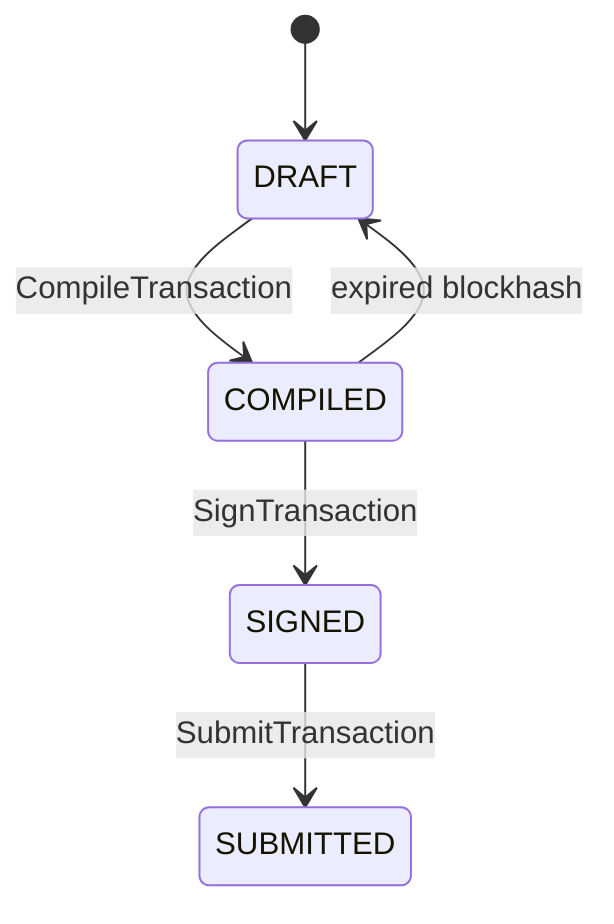
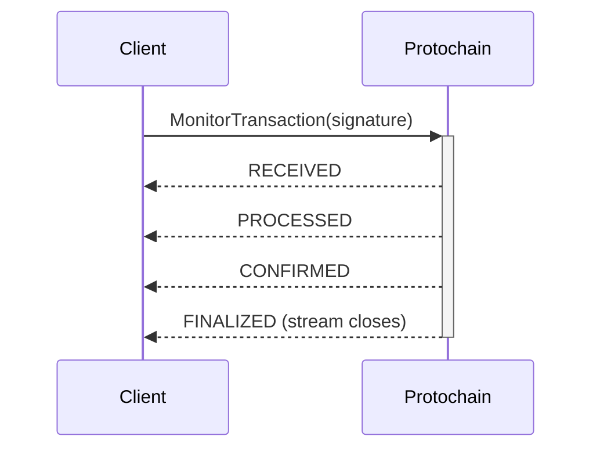

# Technology Stack

**Project:** Protochain Documentation Site
**Researched:** 2026-03-25
**Platform Constraint:** Mintlify — all tooling must work within Mintlify's MDX/docs.json system

---

## Recommended Stack

### Core Platform

| Technology | Version | Purpose | Why |
|------------|---------|---------|-----|
| Mintlify | Current (docs.json schema) | Documentation hosting, rendering, deployment | Already chosen; Git-native CI/CD, MDX component library, AI-ready with llms.txt + MCP auto-generation, zero-config deploy on push |
| MDX | Mintlify-managed | Page authoring | Superset of Markdown; enables Mintlify components inline; no build config required |

**Confidence: HIGH** — Verified against Mintlify docs (mintlify.com/docs), current docs.json already in the repo confirms this is active.

---

### Navigation Structure (docs.json)

Use **tabs** as the top-level division, with **groups** inside each tab for service-oriented grouping. The existing docs.json already uses this pattern.

**Recommended tab structure:**

```json
{
  "navigation": {
    "tabs": [
      { "tab": "Overview",       "groups": [...] },
      { "tab": "Getting Started","groups": [...] },
      { "tab": "Core Concepts",  "groups": [...] },
      { "tab": "API Reference",  "groups": [...] },
      { "tab": "Guides",         "groups": [...] },
      { "tab": "Error Reference","groups": [...] }
    ],
    "global": {
      "anchors": [...]
    }
  }
}
```

**Why tabs over a flat sidebar:** The Protochain docs have at least four distinct audiences/modes — newcomers (Overview/Getting Started), concept learners (Core Concepts), reference users (API Reference per service), and task-oriented users (Guides). Tabs make the top-level context switch explicit rather than requiring deep scroll navigation.

**API Reference tab internal structure:**

```json
{
  "tab": "API Reference",
  "groups": [
    { "group": "Account Service",         "pages": ["api-reference/account/overview", "api-reference/account/get-account", ...] },
    { "group": "Transaction Service",     "pages": ["api-reference/transaction/overview", ...] },
    { "group": "System Program Service",  "pages": ["api-reference/system-program/overview", ...] },
    { "group": "Token Program Service",   "pages": ["api-reference/token-program/overview", ...] },
    { "group": "RPC Client Service",      "pages": ["api-reference/rpc-client/overview", ...] },
    { "group": "Shared Types",            "pages": ["api-reference/types/commitment-level", "api-reference/types/token-program", "api-reference/types/keypair"] }
  ]
}
```

**Why service-oriented grouping:** Matches how developers approach the API — they have an account problem, a transaction problem, a token problem. Cross-cutting by operation type (all Getters, all Setters) forces unnecessary mental mapping.

**Confidence: HIGH** — Confirmed against Mintlify navigation docs and the `docs.json` schema already in the repo.

---

### MDX Components for gRPC API Reference Pages

Mintlify has no built-in gRPC or proto-aware component. All API reference pages must be manually authored MDX. The following components are the recommended toolkit:

#### `RequestExample` + `ResponseExample` (pinned sidebar layout)

**Use for:** Every RPC method page. These components create a sticky two-column layout — prose on the left, code samples pinned on the right.

```mdx
<RequestExample>
```go Go
conn, err := grpc.Dial("localhost:50051", grpc.WithTransportCredentials(insecure.NewCredentials()))
client := account_v1.NewServiceClient(conn)
resp, err := client.GetAccount(ctx, &account_v1.GetAccountRequest{
    Address: "7EcDhSYGxXyscszYEp35KHN8vvw3svAuLKTzXwCFLtV",
})
```
```typescript TypeScript
const client = new ServiceClient('localhost:50051', credentials.createInsecure());
const request = new GetAccountRequest();
request.setAddress('7EcDhSYGxXyscszYEp35KHN8vvw3svAuLKTzXwCFLtV');
const response = await client.getAccount(request);
```
```rust Rust
let mut client = ServiceClient::connect("http://localhost:50051").await?;
let request = tonic::Request::new(GetAccountRequest {
    address: "7EcDhSYGxXyscszYEp35KHN8vvw3svAuLKTzXwCFLtV".to_string(),
    ..Default::default()
});
let response = client.get_account(request).await?;
```
</RequestExample>

<ResponseExample>
```json Response
{
  "account": {
    "address": "7EcDhSYGxXyscszYEp35KHN8vvw3svAuLKTzXwCFLtV",
    "lamports": "1000000",
    "owner": "11111111111111111111111111111111"
  }
}
```
</ResponseExample>
```

**Why RequestExample/ResponseExample over CodeGroup:** These pin the examples in the sidebar so they remain visible while the user scrolls through parameter descriptions. For API reference pages where you want parameter table + visible example simultaneously, this is the right pattern. Use CodeGroup for inline tutorial code blocks instead.

**Confidence: HIGH** — Confirmed via Mintlify component docs.

---

#### `ResponseField` for request/response message documentation

**Use for:** Documenting each field in request and response proto messages. Do NOT use `ParamField` — that component is designed for REST APIs and automatically adds an API Playground (which is useless for gRPC). `ResponseField` is playground-free and works for both inputs and outputs.

```mdx
<ResponseField name="address" type="string" required>
  Base58-encoded account address to fetch from the Solana network.
</ResponseField>

<ResponseField name="commitment_level" type="CommitmentLevel">
  Optional. Controls which version of the ledger state is queried.
  Defaults to `COMMITMENT_LEVEL_CONFIRMED`. See [CommitmentLevel](/api-reference/types/commitment-level).
</ResponseField>
```

**Why ResponseField over ParamField:** `ParamField` triggers API Playground generation. Protochain uses gRPC over port 50051 — there is no REST endpoint to play against. Using `ParamField` would create broken, confusing UI. `ResponseField` provides the same visual formatting without the playground.

**Confidence: HIGH** — Verified against Mintlify Fields component docs; ParamField playground behavior confirmed.

---

#### `CodeGroup` for inline tutorial code blocks

**Use for:** Getting started guides and workflow guides where you want language tabs inline (not pinned sidebar). The tab synchronization feature — selecting "Go" in one CodeGroup updates all CodeGroups on the page — is valuable in multi-step guides.

```mdx
<CodeGroup>
```go Go
// Step 1: Connect to Protochain
conn, err := grpc.Dial("localhost:50051", grpc.WithTransportCredentials(insecure.NewCredentials()))
```
```typescript TypeScript
// Step 1: Connect to Protochain
const credentials = require('@grpc/grpc-js').credentials;
const channel = credentials.createInsecure();
```
```rust Rust
// Step 1: Connect to Protochain
let channel = Channel::from_static("http://localhost:50051").connect().await?;
```
</CodeGroup>
```

**Confidence: HIGH** — Confirmed via Mintlify CodeGroup docs; tab sync behavior verified.

---

#### `Expandable` for nested proto message types

**Use for:** Request/response fields that are themselves complex message types (e.g., a `Transaction` field that contains `instructions`, `keypairs`, etc.). Avoids page bloat while keeping types explorable inline.

```mdx
<ResponseField name="transaction" type="Transaction" required>
  The compiled transaction object.
  <Expandable title="Transaction fields">
    <ResponseField name="state" type="TransactionState">
      Current state in the lifecycle: DRAFT, COMPILED, SIGNED, or SUBMITTED.
    </ResponseField>
    <ResponseField name="instructions" type="Instruction[]">
      Ordered list of program instructions.
    </ResponseField>
  </Expandable>
</ResponseField>
```

**Confidence: HIGH** — Documented Mintlify component; standard pattern for nested API types.

---

#### Mermaid diagrams for state machines and sequence flows

**Use for:** The transaction state machine (DRAFT → COMPILED → SIGNED → SUBMITTED) and the MonitorTransaction streaming flow. Mintlify renders Mermaid natively with interactive zoom/pan.

```mdx

```

Sequence diagram pattern for streaming RPC:

```mdx

```

**Confidence: HIGH** — Mintlify Mermaid support confirmed with all standard diagram types.

---

#### `Steps` for lifecycle walkthrough pages

**Use for:** Getting started guide, common workflow guides (create token, transfer SOL, monitor transaction). Each step maps to one gRPC call.

```mdx
<Steps>
  <Step title="Compile the transaction">
    Call `CompileTransaction` with your draft transaction...
  </Step>
  <Step title="Estimate fees">
    Call `EstimateTransaction` to get compute units and fee lamports...
  </Step>
</Steps>
```

**Confidence: HIGH** — Standard Mintlify component.

---

#### Callouts (`Note`, `Warning`, `Info`, `Tip`) for proto-specific nuances

**Use for:** Surfacing gotchas that don't fit in field descriptions. Key candidates:

- `<Warning>` on SubmitTransaction: async submission, not confirmation
- `<Warning>` on SignTransaction: private keys in plaintext — not for production
- `<Note>` on MonitorTransaction: only streaming RPC in the entire API
- `<Info>` on CommitmentLevel: defaults to CONFIRMED if not set

**Confidence: HIGH** — Standard Mintlify component.

---

### Reusable Snippets System

**Location:** `/snippets/` directory (already exists in the repo)

**Use snippets for content that repeats across multiple pages:**

| Snippet | Reused By |
|---------|-----------|
| `snippets/commitment-level-note.mdx` | Every method that takes a `CommitmentLevel` parameter |
| `snippets/grpc-connection-go.mdx` | Getting started, all Go code setup |
| `snippets/grpc-connection-ts.mdx` | Getting started, all TS code setup |
| `snippets/grpc-connection-rust.mdx` | Getting started, all Rust code setup |
| `snippets/base58-note.mdx` | All methods that take address strings |
| `snippets/token-program-field.mdx` | Token Program Service methods |

**Import syntax (absolute path):**
```mdx
import CommitmentLevelNote from "/snippets/commitment-level-note.mdx";

<CommitmentLevelNote />
```

**Snippet with props (for parameterized content):**
```mdx
{/* snippets/method-returns.mdx */}
This method returns immediately. {note}

{/* Usage */}
import MethodReturns from "/snippets/method-returns.mdx";
<MethodReturns note="Use MonitorTransaction to poll for confirmation." />
```

**Why snippets matter here:** CommitmentLevel appears in almost every method request. The `base58-note` will be needed on ~10 pages. Snippets prevent drift when the explanation needs updating.

**Confidence: HIGH** — Mintlify snippets system confirmed via docs and existing `/snippets/snippet-intro.mdx` in this repo.

---

### Code Language Support

All three SDK languages are supported natively by Mintlify's syntax highlighter:

| Language | Code Fence Tag | SDK Package Pattern |
|----------|---------------|---------------------|
| Go | `go` | `github.com/meshtrade/protochain/lib/go/protochain/solana/[service]/v1` |
| Rust | `rust` | `protochain` crate (tonic-generated) |
| TypeScript | `typescript` or `ts` | `@protochain/solana-[service]-v1` (assumed) |
| Protocol Buffers | `protobuf` | For showing proto definitions as source of truth |
| JSON | `json` | For showing example request/response payloads |
| Shell | `bash` | For showing grpcurl invocations |

**Recommendation:** Standardize on the three SDK languages (Go, Rust, TypeScript) for all RPC method examples. Add a `grpcurl` tab where helpful for quick testing (grpcurl is the closest thing to curl for gRPC). **Do not** include a REST/HTTP tab — there is no REST interface.

**Tab label convention:** Use `Go`, `Rust`, `TypeScript` (title case, no version numbers) so Mintlify's automatic tab-sync works correctly across the page.

**Confidence: HIGH** — Mintlify language support confirmed; label synchronization requires exact label matching.

---

### AI-Readiness Features (Already Configured)

The existing `docs.json` already enables the contextual menu with `copy`, `view`, `chatgpt`, `claude`, `perplexity`, `mcp`, `cursor`, and `vscode`. This is the current Mintlify best practice for 2025.

Mintlify auto-generates:
- `/llms.txt` — sitemap for AI indexing
- `/llms-full.txt` — entire docs as single markdown file

No additional configuration is needed. The `contextual` block in `docs.json` is already populated correctly.

**Confidence: HIGH** — Verified against current docs.json in this repo and Mintlify AI ingestion docs.

---

### Deployment

| Mechanism | Details |
|-----------|---------|
| GitHub push → auto-deploy | Mintlify GitHub App deploys on every push to the connected branch |
| Preview deployments | Available per PR via Mintlify dashboard |
| Custom domain | Configure via Mintlify dashboard DNS settings |
| Local preview | `mintlify dev` via `npm install -g mintlify` |

**Confidence: HIGH** — Standard Mintlify deployment model, confirmed in multiple sources.

---

## Alternatives Considered

| Category | Recommended | Alternative | Why Not |
|----------|-------------|-------------|---------|
| Platform | Mintlify | Docusaurus | Mintlify is already chosen and configured; Docusaurus would require build tooling, MDX config, custom theme work |
| Platform | Mintlify | Fern | Fern has native gRPC/proto support with auto-generation, but is a different platform — project is already on Mintlify |
| API ref | Manual MDX with ResponseField | ParamField | ParamField adds broken API Playground — no REST endpoint exists |
| Code examples | RequestExample/ResponseExample | Inline CodeGroup | Pinned sidebar keeps examples visible while reading parameters — better for reference pages |
| Diagrams | Mermaid (built-in) | Excalidraw embeds | Mermaid is text-as-code, version-controllable, renders natively in Mintlify |
| Snippets | `/snippets/*.mdx` | Inline repetition | CommitmentLevel appears on ~15 pages; single source prevents drift |

---

## Installation

The project is already initialized. For local development:

```bash
npm install -g mintlify
mintlify dev
```

No additional packages are required. All components (CodeGroup, ResponseField, Mermaid, Steps, etc.) are built into Mintlify — no npm installs needed.

---

## Sources

- Mintlify components overview: https://www.mintlify.com/docs/components (MEDIUM — page 404'd, content verified via llms-full.txt)
- Mintlify Fields (ParamField/ResponseField): https://mintlify.com/docs/components/fields (HIGH)
- Mintlify CodeGroup: https://mintlify.com/docs/content/components/code-groups (HIGH)
- Mintlify RequestExample/ResponseExample: https://mintlify.com/docs/components/examples (HIGH)
- Mintlify reusable snippets: https://www.mintlify.com/docs/create/reusable-snippets (HIGH)
- Mintlify navigation: https://www.mintlify.com/docs/organize/navigation (HIGH)
- Mintlify navigation divisions (tabs/anchors): https://mintlify.com/docs/navigation/divisions (MEDIUM — 404'd, content verified via search)
- Mintlify Mermaid: https://www.mintlify.com/docs/components/mermaid-diagrams (HIGH)
- Mintlify AI contextual menu: https://www.mintlify.com/docs/ai/contextual-menu (HIGH)
- Mintlify AI ingestion: https://mintlify.com/docs/ai-ingestion (HIGH)
- Mintlify docs.json refactor blog: https://www.mintlify.com/blog/refactoring-mint-json-into-docs-json (MEDIUM)
- Protochain proto files: `/Users/kylesmith/Development/protochain/lib/proto/` (HIGH — source of truth)
