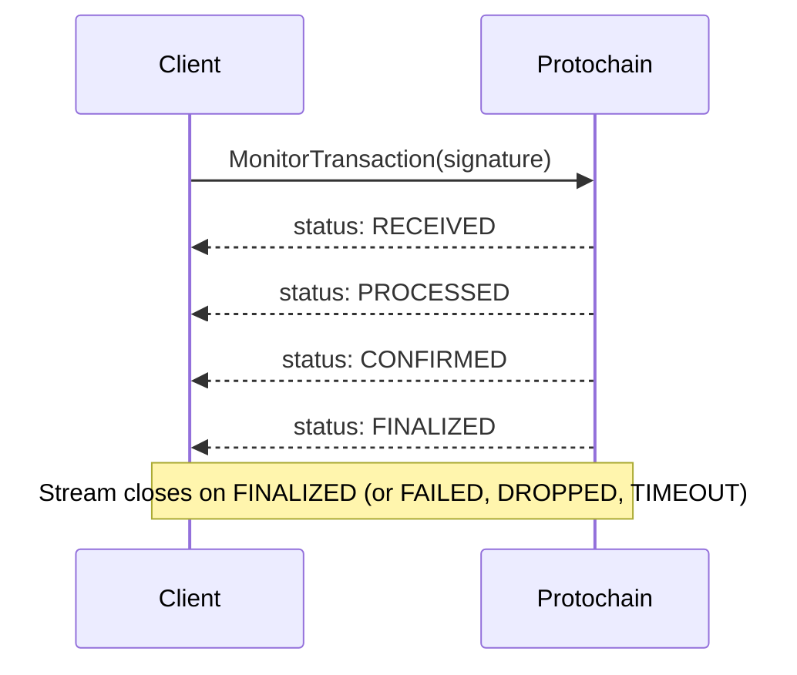

Monitors an on-chain transaction's progress by streaming status updates until the transaction reaches a terminal state. Call MonitorTransaction immediately after [SubmitTransaction](/api-reference/transaction/submit-transaction) using the returned signature.

<Note>
  MonitorTransaction is a **server-streaming RPC** — the server sends multiple response messages over a single connection until the transaction reaches a terminal state. Consuming it requires a different pattern than unary calls. See the code examples below for the full stream loop.
</Note>

## Stream Lifecycle

When you call MonitorTransaction, the server begins watching for the transaction and emits a new response message each time the transaction advances to a new status. The stream remains open until a terminal status is reached.



The stream closes when any of the following terminal statuses are received: **FINALIZED**, **FAILED**, **DROPPED**, or **TIMEOUT**. If `commitment_level` is set to CONFIRMED, the stream closes on CONFIRMED without waiting for FINALIZED.

## Request

<ResponseField name="signature" type="Base58-encoded string" required>
  The transaction signature to monitor. Returned by [SubmitTransaction](/api-reference/transaction/submit-transaction).
</ResponseField>

<ResponseField name="commitment_level" type="CommitmentLevel (enum)">
  Optional. The target commitment level — the stream closes when this level is reached (or on FINALIZED if FINALIZED was requested). Defaults to CONFIRMED.

  <CommitmentLevelNote />
</ResponseField>

<ResponseField name="include_logs" type="bool">
  Optional. If true, program execution logs are included in status update responses. Defaults to false.
</ResponseField>

<ResponseField name="timeout_seconds" type="uint32">
  Optional. How many seconds to monitor before emitting a TIMEOUT status and closing the stream. Defaults to 60 seconds.
</ResponseField>

## Stream Responses

Each message in the stream is a `MonitorTransactionResponse`:

<ResponseField name="signature" type="Base58-encoded string">
  The signature being monitored.
</ResponseField>

<ResponseField name="status" type="TransactionStatus (enum)">
  The current on-chain status of the transaction. See [TransactionStatus Values](#transactionstatus-values) below.
</ResponseField>

<ResponseField name="slot" type="uint64">
  The blockchain slot where this status was recorded.
</ResponseField>

<ResponseField name="error_message" type="string">
  Human-readable error details. Populated when `status` is FAILED.
</ResponseField>

<ResponseField name="logs" type="string[]">
  Program execution log lines. Only populated if `include_logs` was true in the request.
</ResponseField>

<ResponseField name="compute_units_consumed" type="uint64">
  Compute units consumed by the transaction. Available on PROCESSED and later statuses.
</ResponseField>

<ResponseField name="current_commitment" type="CommitmentLevel (enum)">
  The commitment level that has been achieved at the time of this update.
</ResponseField>

## TransactionStatus Values

| Status | Value | Meaning | Stream Behavior |
|--------|-------|---------|-----------------|
| `TRANSACTION_STATUS_UNSPECIFIED` | 0 | Not set | — |
| `TRANSACTION_STATUS_RECEIVED` | 1 | Transaction received by a validator | Stream continues |
| `TRANSACTION_STATUS_PROCESSED` | 2 | Transaction processed (Processed commitment) | Stream continues |
| `TRANSACTION_STATUS_CONFIRMED` | 3 | Transaction confirmed (Confirmed commitment) | Stream continues or closes (if `commitment_level` = CONFIRMED) |
| `TRANSACTION_STATUS_FINALIZED` | 4 | Transaction finalized (Finalized commitment) | **Stream closes** |
| `TRANSACTION_STATUS_FAILED` | 5 | Transaction failed during on-chain execution | **Stream closes** |
| `TRANSACTION_STATUS_DROPPED` | 6 | Transaction dropped from the network | **Stream closes** |
| `TRANSACTION_STATUS_TIMEOUT` | 7 | Monitoring window expired | **Stream closes** |

<Note>
  **TIMEOUT** means the monitoring window expired, not that the transaction failed. The transaction may still be processing on-chain. If you receive TIMEOUT, call [GetTransaction](/api-reference/transaction/get-transaction) to check current status, or start a new MonitorTransaction with the same signature.

  **DROPPED** means the transaction was not processed. If the transaction's blockhash has not yet expired, you may resubmit. If expired, call [CompileTransaction](/api-reference/transaction/compile-transaction) to recompile with a fresh blockhash.
</Note>

## Code Examples

The following examples show the full stream consumption loop — the minimal API call plus status handling for each terminal state.

<CodeGroup>

```go Go
stream, err := client.MonitorTransaction(ctx, &transaction_v1.MonitorTransactionRequest{
    Signature: "YourTransactionSignature1111111111111111111",
})
if err != nil {
    log.Fatal(err)
}

for {
    resp, err := stream.Recv()
    if err == io.EOF {
        break // Stream closed by server
    }
    if err != nil {
        log.Printf("Stream error: %v", err)
        break
    }

    fmt.Printf("Status: %v (slot %d)\n", resp.Status, resp.Slot)

    switch resp.Status {
    case transaction_v1.TransactionStatus_TRANSACTION_STATUS_FINALIZED:
        fmt.Println("Transaction finalized")
        return
    case transaction_v1.TransactionStatus_TRANSACTION_STATUS_FAILED:
        fmt.Printf("Transaction failed: %s\n", resp.ErrorMessage)
        return
    case transaction_v1.TransactionStatus_TRANSACTION_STATUS_DROPPED:
        fmt.Println("Transaction dropped — consider resubmitting")
        return
    case transaction_v1.TransactionStatus_TRANSACTION_STATUS_TIMEOUT:
        fmt.Println("Monitoring timed out — check GetTransaction for current status")
        return
    }
}
```

```rust Rust
let mut stream = client.monitor_transaction(tonic::Request::new(MonitorTransactionRequest {
    signature: "YourTransactionSignature1111111111111111111".to_string(),
    ..Default::default()
})).await?.into_inner();

while let Some(resp) = stream.message().await? {
    println!("Status: {:?} (slot {})", resp.status(), resp.slot);

    match resp.status() {
        TransactionStatus::Finalized => {
            println!("Transaction finalized");
            break;
        }
        TransactionStatus::Failed => {
            println!("Transaction failed: {}", resp.error_message);
            break;
        }
        TransactionStatus::Dropped => {
            println!("Transaction dropped — consider resubmitting");
            break;
        }
        TransactionStatus::Timeout => {
            println!("Monitoring timed out — check GetTransaction for current status");
            break;
        }
        _ => {} // RECEIVED, PROCESSED, CONFIRMED — stream continues
    }
}
```

```typescript TypeScript
const req = new MonitorTransactionRequest();
req.setSignature("YourTransactionSignature1111111111111111111");

const stream = client.monitorTransaction(req);

stream.on("data", (response) => {
  const status = response.getStatus();
  console.log(`Status: ${status} (slot ${response.getSlot()})`);

  switch (status) {
    case TransactionStatus.TRANSACTION_STATUS_FINALIZED:
      console.log("Transaction finalized");
      break;
    case TransactionStatus.TRANSACTION_STATUS_FAILED:
      console.log("Transaction failed:", response.getErrorMessage());
      break;
    case TransactionStatus.TRANSACTION_STATUS_DROPPED:
      console.log("Transaction dropped — consider resubmitting");
      break;
    case TransactionStatus.TRANSACTION_STATUS_TIMEOUT:
      console.log("Monitoring timed out — check GetTransaction");
      break;
  }
});

stream.on("end", () => console.log("Stream closed"));
stream.on("error", (err) => console.error("Stream error:", err));
```

</CodeGroup>

<Note>
  The examples above show the basic stream consumption loop. For production use — including reconnection logic, exponential backoff, and multi-signature monitoring — see the [Monitor Transactions guide](/guides/monitor-transaction).
</Note>
